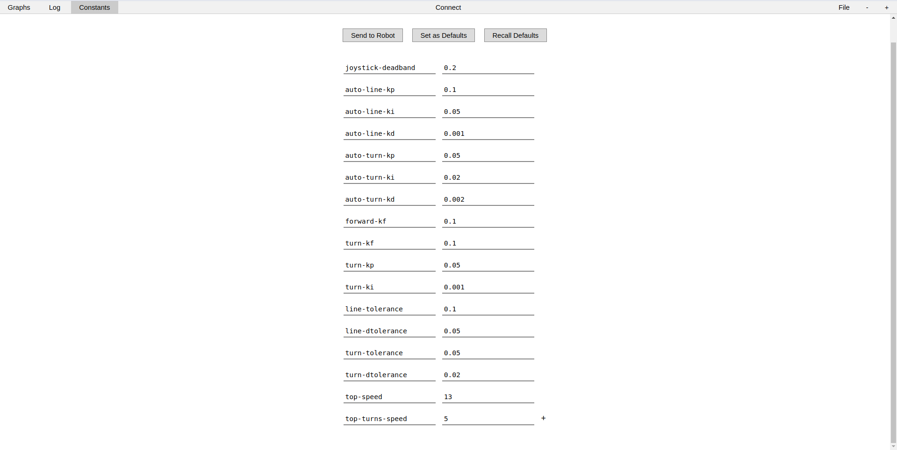

# RoboLog
A dashboard for FRC programming.

RoboLog provides three functions to help you code your robot: [graphing](#graphing) and [logging](#logging) help you understand what your robot is doing, and [constants](#constants) let you tune robot code quickly and robustly.

## Installation
### Client (laptop side)
1. Download the latest RoboLog Client from the releases page.
2. Unzip the file and open `index.html` to open the dashboard.
3. (Recommended) Make a shortcut to `index.html` on your desktop for easy access.
4. Connect to the robot (once you've set up the server) by clicking "Connect."

### Server (robot side)
1. Download the latest RoboLog Server from the releases page.
2. Place the .jar file in `{your home directory}/wpilib/user/java/lib`.
3. If Eclipse is already open, you need to relaunch it for the new library to be recognized.
4. Usage instructions for the server can be found in the [RoboLogServer](https://github.com/cruzsbrian/RoboLogServer) repository.

## Graphing

RoboLog receives live data from the robot every 50ms and graphs it. The robot also sends time information with each point, so the graph reflects the real timing of events.

When you first open RoboLog, you will see a blank graph with the text, "Click to configure a graph." Clicking it will open a menu where you can set the graph's title, its y range, and the specific data you want to show in the graph. Once you click "Done," the graph will be created. You can change its settings at any time by clicking the gear icon in the lower right corner of the graph. To add another graph, click the **+** button in the top right corner. To remove a graph, click the **-** icon and click the graph you want to remove.

## Logging

RoboLog also allows you to capture data with logs. Logs are sent with a timestamp and a user-specified subject, which you can use to filter logs on the dashboard. Like graphs, you can add or remove logs with the **+** and **-** icons in the upper right corner. Each log has its own filter, which is accessible from the gear icon. Clicking the up arrow will free the log's scrolling (it will no longer scroll down automatically as new logs come in). Clicking it again will return the log to the bottom.

## Constants

Finally, RoboLog's constants are a best-of-both-worlds solution to robot constants files. Like other web-based constants utilities, changes are sent to the robot immediately so you don't have to re-deploy your code, but they are also stored in a properties file on the robot, which means that the robot will have access to the constants even if the dashboard is disconnected.

All constants are stored in key-value pairs. After editing constants, click "Send to Robot" to send the constants to the robot. Clicking "Set as Defaults" will also store the constants in the robot's file, so it will load them by itself next time it boots. If you want to recall the constants from the file, click "Recall Defaults." This will revert the constants to the last time you clicked "Set as Defaults."

You can add new constants by clicking the **+** icon in the upper right and remove them by clicking the **-** icon.
